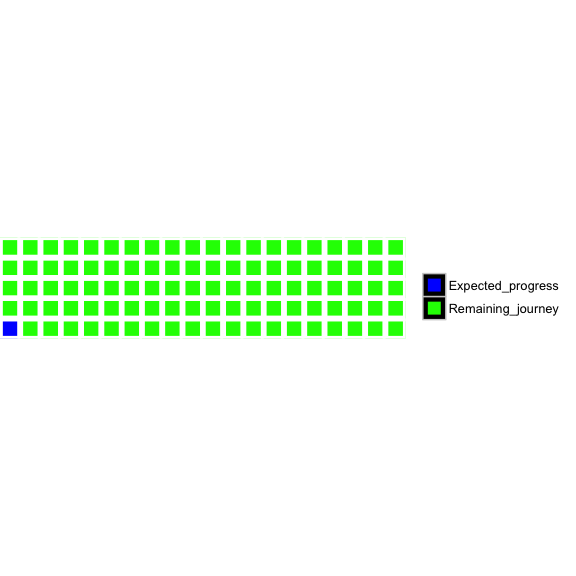

# 한국외대 통계학과 영상 개체인식 개발 프로젝트

## HUFS department of statistics project - Video or Image pattern recognition analysis

본 프로젝트는 **각종 다양한 포맷의 영상에 대해서 개체를 인지하고, 인지한 개체의 정보를 자동적으로 태그하는 방법론을 생각해보고 구현해보며 실제로 동작하는 어플리케이션을 만드는 프로젝트** 입니다.  
현재 기술의 급변으로 인하여 영상의 포맷은 다양해졌고, 변칙적이며, 고해상도화 되고 있어 이와 비례 고용량화 되고 있습니다.  
이러한 다양한 상황에 대해 개체인식을 일반화할 수 있는 통계적 알고리즘을 생각해보고 연구하며, 최종적으로 동작하는 어플리케이션을 완성하는것이 목적입니다.  

아래 링크는 본 프로젝트가 추구하는 주제와 직접적으로 혹은 간접적으로 연관되는 것으로 생각되는 동영상 자료들입니다.  
혹은 이를 이용하여 다른 영감을 받아 다른 아이디어를 실현해 볼 수도 있을것 입니다.  

* [Tutorial: Real-Time Object Tracking Using OpenCV](https://www.youtube.com/watch?v=bSeFrPrqZ2A)
* [Stable Multi-Target Tracking in Real-Time Surveillance Video (CVPR 2011)](https://www.youtube.com/watch?v=InqV34BcheM)
* [Fast Object Tracking (Ball Tracking) with the OpenCV Library](https://www.youtube.com/watch?v=CigGvt3DXIw)

단 우리가 목표로 하는 어플리케이션은 존재하고 있고, 게다가 오픈되어 있을 수 있습니다.  
하지만 그와 별개로 우리가 스스로의 힘을 이용해 알고리즘을 개발, 구현, 어플리케이션화 하는 전과정을 A 부터 Z 까지 직접해 봄으로써 얻을 수 있는 무형의 성취 & 성과를 중시할 것 입니다.  

본 글은 이러한 프로젝트의 일원으로써 함께 해 줄 사람을 찾고 있는 **구인글**로 보면 됩니다.  
자세한 사항은 아래에 기술할 것인데, 읽어보고 많은 공감이 생기거나 프로젝트에 뛰어들고 싶은 욕심이 생기면 연락 바랍니다.  
연락방법은 저에게 [메일](mailto:lt.lovetoken@gmail.com)을 보내주셔도 되고, 만나서 이야기 해도되며 자유롭게 컨택하시면 됩니다.  

## A) 프로젝트의 전반적 환경

본 프로젝트의 워크플로우와 관리방법은 전적으로 **[애자일 소프트웨어 개발(Agile software development)](https://ko.wikipedia.org/wiki/%EC%95%A0%EC%9E%90%EC%9D%BC_%EC%86%8C%ED%94%84%ED%8A%B8%EC%9B%A8%EC%96%B4_%EA%B0%9C%EB%B0%9C) 을 지향**할 것 입니다.[^1]  
애자일 소프트웨어 개발 방법론과 완벽히 부합할 수는 없더라도, 이러한 이상(Agile)을 끊임없이 추구 하고자 합니다.

프로젝트의 책임자는 프로젝트에 기여하는 구성원 모두에게로 부여할 것 입니다.  
현재 프로젝트를 구상하고 사람을 구하기위한 이 글을 작성한 제가 현 프로젝트의 100% 책임자라고 할 수 있으나,  
프로젝트원이 추가되어 n명이 되었을 때 1/n % 의 동일비율로 책임이 나눠진다고 볼 수 있습니다.  
동일비율의 책임은 즉 수직적인 상명하복의 관계가 아닌 수평적 관계로써  
서로의 의견과 아이디어들이 중력을 거슬러 위아래로 오르락 내리락하여 전달되는것이 아닌  
평평한 곳에서 빠르게 흐를 수 있는 환경을 제공하고자 합니다.  

[^1]: 위키피디아의 내용만으로 애자일 소프트웨어 개발의 정의를 설명하기는 사실 부족합니다. 필자는 [애자일&스크럼 프로젝트 관리 (길벗)](http://book.naver.com/bookdb/book_detail.nhn?bid=10542525) 책을 통해 애자일 소프트웨어 개발을 이해하였고 큰 맥락을 빠르게 알기 위한 설명은 위키피디아 내용이 적합하다 생각하였습니다.

## B) 프로젝트의 동작환경

본 프로젝트는 **프로그래밍 언어 R을 기반으로 동작하게끔 구현하는 것을 목표**로 잡았습니다.   
서버 및 클라이언트 모두 R을 기반으로 할 것이며, 서버단이 필요할 경우 [AWS(Amazon Web Service)](http://aws.amazon.com/ko/) 를 이용하여 구축하고자 합니다.   
파일의 공유는 [Google Drive](https://www.google.co.kr/intl/ko/drive/) 를 이용합니다.   
VCS(Version Control System) 는 [Git](https://git-scm.com/) 을 이용할 것 이며, [Github](https://github.com/) repository 를 이용하여 버전이력을 공유합니다.   
추가적으로 프로젝트시 필요한 소통 도구로는 사적인 공간과 완벽한 격리를 위하여 [Quip](https://quip.com/) 혹은 [Slack](https://slack.com/) 혹은 [잔디(Jandi)](https://www.jandi.com/landing/kr) 를 사용할 생각 입니다.  

개발중간에 상황이 여의치 않아 다른 동작환경이 필요하다면 (ex. SPSS, SAS, Python, Java, VBA, SQL, C, OpenCV, Matlab, Javascript 등등과 같은) 서브적인 사용을 고려해 보겠지만 위에서 소개한 도구를 사용한다는 전제의 틀은 부시지 않고 진행할 것 입니다.  
따라서 프로젝트 구성원 모두 R을 통한 기본적인 소통이 되어야 한다는 자격요건이 있습니다.  
AWS, Git 그리고 의사소통도구는 프로젝트의 본질적인 것과는 거리가 있는 것이므로 이들의 이해를 필요로 하지 않습니다, [^2] 자격요건에서 논외입니다.  

[^2]: 단 프로젝트의 소규모 브렌치 관리자에겐 Git 에 대한 이해가 필요할 수 있습니다.  

## C) 프로젝트원 구인

프로젝트의 명칭 그대로 한국외국어대학교 통계학과 대학생 혹은 대학원생을 대상으로 모집합니다.  
프로젝트의 시작은 한국외국어 대학교 통계학과 대학원생들의 뜻으로 인해 시작되었지만, 이 뜻에 많은것을 의미있게 생각하는 통계학과 학부생이 있다면 프로젝트의 일조를 요청하고자 합니다.  
단 앞서 말했던 자격요건이 한가지 있는데 **R을 통해 협업과 의사소통이 가능할 정도의 입문기를 땐 초급 이상의 수준 요건**이 필요합니다.  
그 외에 필요할 것으로 예상되는 기술들을 생각나는대로 나열해 보도록 하겠습니다.  
목록을 참조하시고 나의 능력을 프로젝트에 일조할 수 있겠다 확신되시는 분들은 많은 참여 바랍니다.

* R programming : 필수
* 통계이론들을 프로그래밍을 통해 구체화 하여 사용해 보려는 시도
* 패턴인식에 관련된 관심
* 이미지 프로세싱 (Image processing) 과 같은 그림 및 영상데이터와 관련된 Domain knowledge 에 대한 관심
* 기계학습 (Machine learning) 에 대한 관심
* Cloud computing service 를 이용한 파일 공유서비스 (ex. Dropbox, Google Drive, Onedrive) 사용 경험
* 체계화된 협업의 기술을 배우길 희망하고, 생산성을 증대시키기 위한 궁리를 좋아하시는 분

## D) 프로젝트 기타 상세계획

### D-1) 오픈소스

본 프로젝트에 개발될 소스들은 접근성을 극대화 시키기위해, 접근시 방해될 요인자체가 없게끔 하기 위하여 **Public domain** 으로 하는것을 원칙으로 합니다. 
Public domain 을 채택한 이유는 여러가지가 있습니다.
정리하면 다음과 같습니다.

1. 저작권의 침해 문제나, 제 3자가 소스코드의 이용시 사전 허락에 대해 고려하고 승인하는것과 같은 과정이 불필요해 집니다. 본질적으로 우리는 개발 이외의 행동을 하지 않아도 됨으로써 피로도를 증가시키는 요인을 없애기 위함입니다.  
2. Public domain을 채택함으로써 소스코드의 접근시 방해되는 요인들로부터 자유롭게 됩니다. 이는 즉 원활한 협업으로 이어지게 됩니다.  
3. 2번과 이어지는 이야기지만 Public domain 이면 실시간으로 코드의 조회와 수정 그리고 Commit 이 가능한 환경을 제공할 수 있기 때문에 정보전달의 스피디함을 이용하여 제 3자의 피드백을 빠르게 받을 수 있습니다.  
4. 애초에 현 시대는 우리가 개발할 기술과 노력들을 숨김으로써 그 가치를 보존할 수 없는 시대라고 생각합니다. 되려 자신의 기술을 숨기기 위한 노력의 비용과 피로도들을 손해로 볼 수 있습니다.  

이러한 생각들은 기본적으로 [GNU 선언문](http://www.gnu.org/gnu/manifesto.ko.html)의 철학을 표방하였습니다.

### D-2) 부대비용

프로젝트의 비용은 오직 시간적 비용만을 들이고자 합니다.  
즉 **금전적 비용은 Zero 가 되도록 프로젝트를 진행**할 것입니다.  
이 이유는 금전적인 비용이 발생될 경우 이를 관리하여야 할 임무가 추가적으로 발생되는데, 프로젝트의 본질적인 개발 이외의 행동을 하므로써 피로도를 증가시키지 않기 위해서 입니다.  
만약 그럼에도 프로젝트를 진행시 발생되는 부대비용이 있을경우[^3], 그리고 그 부대비용이 월 1만원 이하로 발생될 경우 프로젝트 시초자 Song이 부담하며, 월 1만원 이상으로 발생될 경우 프로젝트 구성원이 1/n 만큼 모두 부담하는것을 원칙으로 합니다.  

[^3]: 굳이 예를 들면 AWS 이용시 정액제로 들어가는 비용과 같은 프로젝트 프로토타입 구현 및 서비스시 발생되는 금전적 비용등이 해당될 듯 싶습니다. 

### D-3) "가상의 고객" 임무를 맡게 될 프로젝트원

효과적인 프로젝트를 하기위해 어떤 환경을 만들것인지 필자는 많은 생각을 가지고 글을 쓰게되었습니다.  
개인적인 생각인데 다수의 프로젝트원이 생기면 그 중 한명이 "가상의 고객" 이 되어 우리에게 구체화된 Needs 를 역으로 요청하는 임무를 맡아주었으면 합니다.  
이런 임무를 가진 사람이 있다면 조금 더 생동감 있고 현실적임과 동시에 동기부여가 있는 프로젝트가 될 수 있다고 생각합니다.  

## E) 프로젝트 현황

### E-1) 프로젝트 구성원

5월 26일 기준 총 2명

* 08학번 송효진
	- 프로젝트 구상 시초자
	- Project total manager
	- E-mail : lt.lovetoken@gmail.com

* 08학번 박은석
	- 프로젝트 구상 시초자
	- Support of technology
	- E-mail : eunseok.park3@gmail.com

### E-2) 프로젝트 진척도, 상태, 한문장으로

* 초반부, 프로젝트원 구인 및 프로세스 구체화 중
* 프로젝트 전체 예상 진척도

